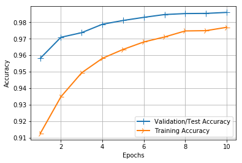

# CNN in Keras 
### Creating a model based on the MNIST Dataset of Handwrittent Digits

### Step 1: Lets load our dataset


```python
from keras.datasets import mnist

# loads the MNIST dataset
(x_train, y_train), (x_test, y_test)  = mnist.load_data()

print (x_train.shape)
```

    (60000, 28, 28)


### Step 2A: Examine the size and image dimenions (not required but good practice)
- Check the number of samples, dimenions and whether images are color or grayscale
- We see that our training data consist of **60,000** samples of training data, **10,000** samples of test data
- Our labels are appropriately sized as well
- Our Image dimenions are **28 x 28**, with **no color channels** (i.e. they are grayscale, so no BGR channels)


```python
# printing the number of samples in x_train, x_test, y_train, y_test
print("Initial shape or dimensions of x_train", str(x_train.shape))

print ("Number of samples in our training data: " + str(len(x_train)))
print ("Number of labels in our training data: " + str(len(y_train)))
print ("Number of samples in our test data: " + str(len(x_test)))
print ("Number of labels in our test data: " + str(len(y_test)))
print()
print ("Dimensions of x_train:" + str(x_train[0].shape))
print ("Labels in x_train:" + str(y_train.shape))
print()
print ("Dimensions of x_test:" + str(x_test[0].shape))
print ("Labels in y_test:" + str(y_test.shape))
```

    Initial shape or dimensions of x_train (60000, 28, 28)
    Number of samples in our training data: 60000
    Number of labels in our training data: 60000
    Number of samples in our test data: 10000
    Number of labels in our test data: 10000
    
    Dimensions of x_train:(28, 28)
    Labels in x_train:(60000,)
    
    Dimensions of x_test:(28, 28)
    Labels in y_test:(10000,)


### Step 2B - Let's take a look at some of images in this dataset
- Using OpenCV
- Using Matplotlib


```python
# Using OpenCV
# import opencv and numpy
import cv2 
import numpy as np

# Use OpenCV to display 6 random images from our dataset
for i in range(0,6):
    random_num = np.random.randint(0, len(x_train))
    img = x_train[random_num]
    window_name = 'Random Sample #' + str(i)
    cv2.imshow(window_name, img)
    cv2.waitKey(0)

cv2.destroyAllWindows()     
```

### Let's do the same thing but using matplotlib to plot 6 images 


```python
# importing matplot lib
import matplotlib.pyplot as plt

# Plots 6 images, note subplot's arugments are nrows,ncols,index
# we set the color map to grey since our image dataset is grayscale
plt.subplot(331)
random_num = np.random.randint(0,len(x_train))
plt.imshow(x_train[random_num], cmap=plt.get_cmap('gray'))

plt.subplot(332)
random_num = np.random.randint(0,len(x_train))
plt.imshow(x_train[random_num], cmap=plt.get_cmap('gray'))

plt.subplot(333)
random_num = np.random.randint(0,len(x_train))
plt.imshow(x_train[random_num], cmap=plt.get_cmap('gray'))

plt.subplot(334)
random_num = np.random.randint(0,len(x_train))
plt.imshow(x_train[random_num], cmap=plt.get_cmap('gray'))

plt.subplot(335)
random_num = np.random.randint(0,len(x_train))
plt.imshow(x_train[random_num], cmap=plt.get_cmap('gray'))

plt.subplot(336)
random_num = np.random.randint(0,len(x_train))
plt.imshow(x_train[random_num], cmap=plt.get_cmap('gray'))

# Display out plots
plt.show()
```


### Step 3A - Prepare our dataset for training


```python
# Lets store the number of rows and columns
img_rows = x_train[0].shape[0]
img_cols = x_train[1].shape[0]

# Getting our date in the right 'shape' needed for Keras
# We need to add a 4th dimenion to our date thereby changing our
# Our original image shape of (60000,28,28) to (60000,28,28,1)
x_train = x_train.reshape(x_train.shape[0], img_rows, img_cols, 1)
x_test = x_test.reshape(x_test.shape[0], img_rows, img_cols, 1)

# store the shape of a single image 
input_shape = (img_rows, img_cols, 1)

# change our image type to float32 data type
x_train = x_train.astype('float32')
x_test = x_test.astype('float32')

# Normalize our data by changing the range from (0 to 255) to (0 to 1)
x_train /= 255
x_test /= 255

print('x_train shape:', x_train.shape)
print(x_train.shape[0], 'train samples')
print(x_test.shape[0], 'test samples')

```

    x_train shape: (60000, 28, 28, 1)
    60000 train samples
    10000 test samples


```python

```

### Step 3B - One Hot Encode Our Labels (Y)


```python
from keras.utils import np_utils

# Now we one hot encode outputs
y_train = np_utils.to_categorical(y_train)
y_test = np_utils.to_categorical(y_test)

# Let's count the number columns in our hot encoded matrix 
print ("Number of Classes: " + str(y_test.shape[1]))

num_classes = y_test.shape[1]
num_pixels = x_train.shape[1] * x_train.shape[2]
```

    Number of Classes: 10


```python
y_train[0]
```


    array([0., 0., 0., 0., 0., 1., 0., 0., 0., 0.], dtype=float32)


### Step 4 - Create Our Model
- We're constructing a simple but effective CNN that uses 32 filters of size 3x3
- We've added a 2nd CONV layer of 64 filters of the same size 3x2
- We then downsample our data to 2x2, here he apply a dropout where p is set to 0.25
- We then flatten our Max Pool output that is connected to a Dense/FC layer that has an output size of 128
- How we apply a dropout where P is set to 0.5
- Thus 128 output is connected to another FC/Dense layer that outputs to the 10 categorical units


```python
import keras
from keras.datasets import mnist
from keras.models import Sequential
from keras.layers import Dense, Dropout, Flatten
from keras.layers import Conv2D, MaxPooling2D
from keras import backend as K
from keras.optimizers import SGD 

# create model
model = Sequential()

model.add(Conv2D(32, kernel_size=(3, 3),
                 activation='relu',
                 input_shape=input_shape))
model.add(Conv2D(64, (3, 3), activation='relu'))
model.add(MaxPooling2D(pool_size=(2, 2)))
model.add(Dropout(0.25))
model.add(Flatten())
model.add(Dense(128, activation='relu'))
model.add(Dropout(0.5))
model.add(Dense(num_classes, activation='softmax'))

model.compile(loss = 'categorical_crossentropy',
              optimizer = SGD(0.01),
              metrics = ['accuracy'])

print(model.summary())
```

    _________________________________________________________________
    Layer (type)                 Output Shape              Param #   
    =================================================================
    conv2d_3 (Conv2D)            (None, 26, 26, 32)        320       
    _________________________________________________________________
    conv2d_4 (Conv2D)            (None, 24, 24, 64)        18496     
    _________________________________________________________________
    max_pooling2d_2 (MaxPooling2 (None, 12, 12, 64)        0         
    _________________________________________________________________
    dropout_3 (Dropout)          (None, 12, 12, 64)        0         
    _________________________________________________________________
    flatten_2 (Flatten)          (None, 9216)              0         
    _________________________________________________________________
    dense_3 (Dense)              (None, 128)               1179776   
    _________________________________________________________________
    dropout_4 (Dropout)          (None, 128)               0         
    _________________________________________________________________
    dense_4 (Dense)              (None, 10)                1290      
    =================================================================
    Total params: 1,199,882
    Trainable params: 1,199,882
    Non-trainable params: 0
    _________________________________________________________________
    None


### Step 5 - Train our Model
- We place our formatted data as the inputs and set the batch size, number of epochs
- We store our model's training results for plotting in future
- We then use Kera's molel.evaluate function to output the model's fina performance. Here we are examing Test Loss and Test Accuracy


```python
batch_size = 32
epochs = 10

history = model.fit(x_train,
                    y_train,
                    batch_size = batch_size,
                    epochs = epochs,
                    verbose = 1,
                    validation_data = (x_test, y_test))

score = model.evaluate(x_test, y_test, verbose=0)
print('Test loss:', score[0])
print('Test accuracy:', score[1])
```

    Train on 60000 samples, validate on 10000 samples
    Epoch 1/10
    60000/60000 [==============================] - 189s 3ms/step - loss: 0.2901 - acc: 0.9124 - val_loss: 0.1392 - val_acc: 0.9581
    Epoch 2/10
    60000/60000 [==============================] - 316s 5ms/step - loss: 0.2177 - acc: 0.9348 - val_loss: 0.1016 - val_acc: 0.9709
    Epoch 3/10
    60000/60000 [==============================] - 319s 5ms/step - loss: 0.1699 - acc: 0.9494 - val_loss: 0.0790 - val_acc: 0.9737
    Epoch 4/10
    60000/60000 [==============================] - 371s 6ms/step - loss: 0.1393 - acc: 0.9581 - val_loss: 0.0673 - val_acc: 0.9788
    Epoch 5/10
    60000/60000 [==============================] - 244s 4ms/step - loss: 0.1199 - acc: 0.9635 - val_loss: 0.0596 - val_acc: 0.9811
    Epoch 6/10
    60000/60000 [==============================] - 179s 3ms/step - loss: 0.1072 - acc: 0.9681 - val_loss: 0.0516 - val_acc: 0.9830
    Epoch 7/10
    60000/60000 [==============================] - 213s 4ms/step - loss: 0.0968 - acc: 0.9711 - val_loss: 0.0481 - val_acc: 0.9847
    Epoch 8/10
    60000/60000 [==============================] - 194s 3ms/step - loss: 0.0874 - acc: 0.9748 - val_loss: 0.0470 - val_acc: 0.9853
    Epoch 9/10
    60000/60000 [==============================] - 193s 3ms/step - loss: 0.0823 - acc: 0.9749 - val_loss: 0.0434 - val_acc: 0.9854
    Epoch 10/10
    60000/60000 [==============================] - 158s 3ms/step - loss: 0.0752 - acc: 0.9769 - val_loss: 0.0413 - val_acc: 0.9860
    Test loss: 0.041306651647796386
    Test accuracy: 0.986


### Step 6 - Ploting our Loss and Accuracy Charts


```python
# Plotting our loss charts
import matplotlib.pyplot as plt

history_dict = history.history

loss_values = history_dict['loss']
val_loss_values = history_dict['val_loss']
epochs = range(1, len(loss_values) + 1)

line1 = plt.plot(epochs, val_loss_values, label='Validation/Test Loss')
line2 = plt.plot(epochs, loss_values, label='Training Loss')
plt.setp(line1, linewidth=2.0, marker = '+', markersize=10.0)
plt.setp(line2, linewidth=2.0, marker = '4', markersize=10.0)
plt.xlabel('Epochs') 
plt.ylabel('Loss')
plt.grid(True)
plt.legend()
plt.show()
```


```python
# Plotting our accuracy charts
import matplotlib.pyplot as plt

history_dict = history.history

acc_values = history_dict['acc']
val_acc_values = history_dict['val_acc']
epochs = range(1, len(loss_values) + 1)

line1 = plt.plot(epochs, val_acc_values, label='Validation/Test Accuracy')
line2 = plt.plot(epochs, acc_values, label='Training Accuracy')
plt.setp(line1, linewidth=2.0, marker = '+', markersize=10.0)
plt.setp(line2, linewidth=2.0, marker = '4', markersize=10.0)
plt.xlabel('Epochs') 
plt.ylabel('Accuracy')
plt.grid(True)
plt.legend()
plt.show()
```





```python

```

### Step 7A - Saving our Model


```python
model.save("/home/deeplearningcv/DeepLearningCV/Trained Models/8_mnist_simple_cnn_10_Epochs.h5")
print("Model Saved")
```

    Model Saved


### Step 7B - Loading  our Model


```python
from keras.models import load_model

classifier = load_model('/home/deeplearningcv/DeepLearningCV/Trained Models/8_mnist_simple_cnn_10_Epochs.h5')
```

### Step 8 - Lets input some of our test data into our classifer


```python
import cv2
import numpy as np


def draw_test(name, pred, input_im):
    BLACK = [0,0,0]
    expanded_image = cv2.copyMakeBorder(input_im, 0, 0, 0, imageL.shape[0] ,cv2.BORDER_CONSTANT,value=BLACK)
    expanded_image = cv2.cvtColor(expanded_image, cv2.COLOR_GRAY2BGR)
    cv2.putText(expanded_image, str(pred), (152, 70) , cv2.FONT_HERSHEY_COMPLEX_SMALL,4, (0,255,0), 2)
    cv2.imshow(name, expanded_image)


for i in range(0,10):
    rand = np.random.randint(0,len(x_test))
    input_im = x_test[rand]

    imageL = cv2.resize(input_im, None, fx=4, fy=4, interpolation = cv2.INTER_CUBIC)
    input_im = input_im.reshape(1,28,28,1) 
    
    ## Get Prediction
    res = str(classifier.predict_classes(input_im, 1, verbose = 0)[0])

    draw_test("Prediction", res, imageL) 
    cv2.waitKey(0)

cv2.destroyAllWindows()
```

### Putting All Together!
We don't need to run each section of code separately. Once we know it all works as it's supposed to, we can put all te pieces together and start training our model


```python
from keras.datasets import mnist
from keras.utils import np_utils
import keras
from keras.datasets import mnist
from keras.models import Sequential
from keras.layers import Dense, Dropout, Flatten
from keras.layers import Conv2D, MaxPooling2D
from keras import backend as K
from keras.optimizers import SGD 

# Training Parameters
batch_size = 128
epochs = 10

# loads the MNIST dataset
(x_train, y_train), (x_test, y_test)  = mnist.load_data()

# Lets store the number of rows and columns
img_rows = x_train[0].shape[0]
img_cols = x_train[1].shape[0]

# Getting our date in the right 'shape' needed for Keras
# We need to add a 4th dimenion to our date thereby changing our
# Our original image shape of (60000,28,28) to (60000,28,28,1)
x_train = x_train.reshape(x_train.shape[0], img_rows, img_cols, 1)
x_test = x_test.reshape(x_test.shape[0], img_rows, img_cols, 1)

# store the shape of a single image 
input_shape = (img_rows, img_cols, 1)

# change our image type to float32 data type
x_train = x_train.astype('float32')
x_test = x_test.astype('float32')

# Normalize our data by changing the range from (0 to 255) to (0 to 1)
x_train /= 255
x_test /= 255

print('x_train shape:', x_train.shape)
print(x_train.shape[0], 'train samples')
print(x_test.shape[0], 'test samples')

# Now we one hot encode outputs
y_train = np_utils.to_categorical(y_train)
y_test = np_utils.to_categorical(y_test)

# Let's count the number columns in our hot encoded matrix 
print ("Number of Classes: " + str(y_test.shape[1]))

num_classes = y_test.shape[1]
num_pixels = x_train.shape[1] * x_train.shape[2]

# create model
model = Sequential()

model.add(Conv2D(32, kernel_size=(3, 3),
                 activation='relu',
                 input_shape=input_shape))
model.add(Conv2D(64, (3, 3), activation='relu'))
model.add(MaxPooling2D(pool_size=(2, 2)))
model.add(Dropout(0.25))
model.add(Flatten())
model.add(Dense(128, activation='relu'))
model.add(Dropout(0.5))
model.add(Dense(num_classes, activation='softmax'))

model.compile(loss = 'categorical_crossentropy',
              optimizer = SGD(0.01),
              metrics = ['accuracy'])

print(model.summary())

history = model.fit(x_train, y_train,
          batch_size=batch_size,
          epochs=epochs,
          verbose=1,
          validation_data=(x_test, y_test))

score = model.evaluate(x_test, y_test, verbose=0)
print('Test loss:', score[0])
print('Test accuracy:', score[1])
```

    Using TensorFlow backend.


    x_train shape: (60000, 28, 28, 1)
    60000 train samples
    10000 test samples
    Number of Classes: 10
    _________________________________________________________________
    Layer (type)                 Output Shape              Param #   
    =================================================================
    conv2d_1 (Conv2D)            (None, 26, 26, 32)        320       
    _________________________________________________________________
    conv2d_2 (Conv2D)            (None, 24, 24, 64)        18496     
    _________________________________________________________________
    max_pooling2d_1 (MaxPooling2 (None, 12, 12, 64)        0         
    _________________________________________________________________
    dropout_1 (Dropout)          (None, 12, 12, 64)        0         
    _________________________________________________________________
    flatten_1 (Flatten)          (None, 9216)              0         
    _________________________________________________________________
    dense_1 (Dense)              (None, 128)               1179776   
    _________________________________________________________________
    dropout_2 (Dropout)          (None, 128)               0         
    _________________________________________________________________
    dense_2 (Dense)              (None, 10)                1290      
    =================================================================
    Total params: 1,199,882
    Trainable params: 1,199,882
    Non-trainable params: 0
    _________________________________________________________________
    None
    Train on 60000 samples, validate on 10000 samples
    Epoch 1/10
    60000/60000 [==============================] - 367s 6ms/step - loss: 0.2656 - acc: 0.9180 - val_loss: 0.0651 - val_acc: 0.9781
    Epoch 2/10
    60000/60000 [==============================] - 450s 8ms/step - loss: 0.0918 - acc: 0.9727 - val_loss: 0.0403 - val_acc: 0.9863
    Epoch 3/10
    60000/60000 [==============================] - 475s 8ms/step - loss: 0.0683 - acc: 0.9799 - val_loss: 0.0328 - val_acc: 0.9876
    Epoch 4/10
    60000/60000 [==============================] - 441s 7ms/step - loss: 0.0560 - acc: 0.9838 - val_loss: 0.0310 - val_acc: 0.9888
    Epoch 5/10
    60000/60000 [==============================] - 448s 7ms/step - loss: 0.0471 - acc: 0.9855 - val_loss: 0.0301 - val_acc: 0.9899
    Epoch 6/10
    60000/60000 [==============================] - 458s 8ms/step - loss: 0.0413 - acc: 0.9872 - val_loss: 0.0302 - val_acc: 0.9905
    Epoch 7/10
    60000/60000 [==============================] - 390s 6ms/step - loss: 0.0373 - acc: 0.9887 - val_loss: 0.0274 - val_acc: 0.9911
    Epoch 8/10
    60000/60000 [==============================] - 329s 5ms/step - loss: 0.0343 - acc: 0.9895 - val_loss: 0.0286 - val_acc: 0.9903
    Epoch 9/10
    60000/60000 [==============================] - 199s 3ms/step - loss: 0.0313 - acc: 0.9904 - val_loss: 0.0274 - val_acc: 0.9904
    Epoch 10/10
    60000/60000 [==============================] - 200s 3ms/step - loss: 0.0299 - acc: 0.9909 - val_loss: 0.0272 - val_acc: 0.9915
    Test loss: 0.027194885472155875
    Test accuracy: 0.9915


```python

```

### Visualizing Our Model
- First let's re-create our model 


```python
%matplotlib inline
import keras
from keras.models import Sequential
from keras.utils.vis_utils import plot_model
import matplotlib.pyplot as plt
import matplotlib.image as mpimg
import numpy as np
from keras.utils import np_utils
from keras.layers import Dense, Dropout, Flatten
from keras.layers import Conv2D, MaxPooling2D
from keras import backend as K

input_shape = (28,28,1)
num_classes = 10

model = Sequential()

model.add(Conv2D(32, kernel_size=(3, 3),
                 activation='relu',
                 input_shape=input_shape))
model.add(Conv2D(64, (3, 3), activation='relu'))
model.add(MaxPooling2D(pool_size=(2, 2)))
model.add(Dropout(0.25))
model.add(Flatten())
model.add(Dense(128, activation='relu'))
model.add(Dropout(0.5))
model.add(Dense(num_classes, activation='softmax'))

model.compile(loss=keras.losses.categorical_crossentropy,
              optimizer=keras.optimizers.Adadelta(),
              metrics=['accuracy'])

print(model.summary()) 
```

### Generating the diagram of the model architecture


```python
# Save our model diagrams to this path
model_diagrams_path = '/home/deeplearningcv/DeeplearningCV/Trained Models/'

# Generate the plot
plot_model(model, to_file = model_diagrams_path + 'model_plot.png',
           show_shapes = True,
           show_layer_names = True)

# Show the plot here
img = mpimg.imread(model_diagrams_path + 'model_plot.png')
plt.figure(figsize=(30,15))
imgplot = plt.imshow(img) 
```
